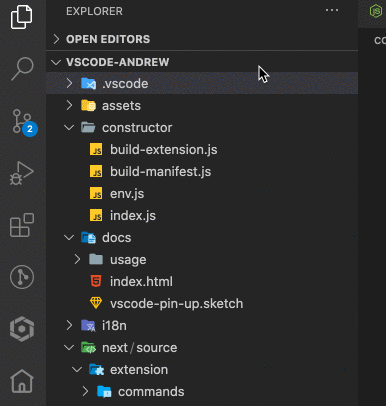
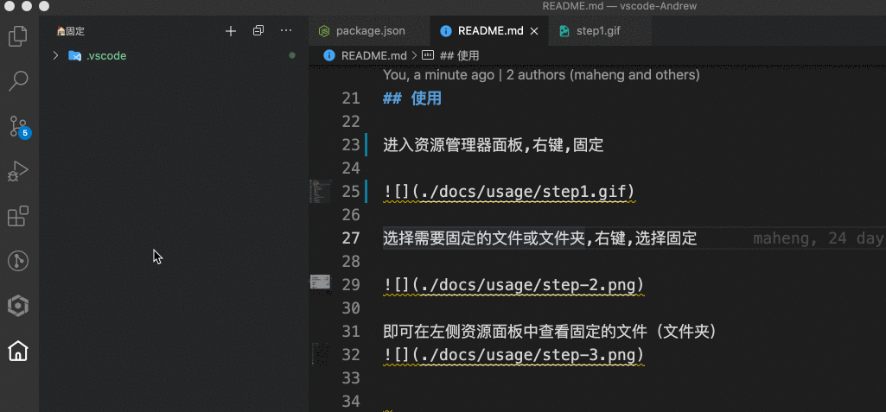

<h1 align="center">
   
    
   
   
  🏠 vscode-Andrew
   
   
</h1>

<h4 align="center">An VSCode extension that allows you to 
pin up some frequently opened files</h4>

## 功能

##### 固定常用文件
##### 提供tigerui snippets支持

##### 更多功能敬请期待...

## 使用

进入资源管理器面板,选择需要固定的文件或文件夹,右键,选择固定

点击左侧🏠菜单栏，即可查看固定的文件/文件夹

